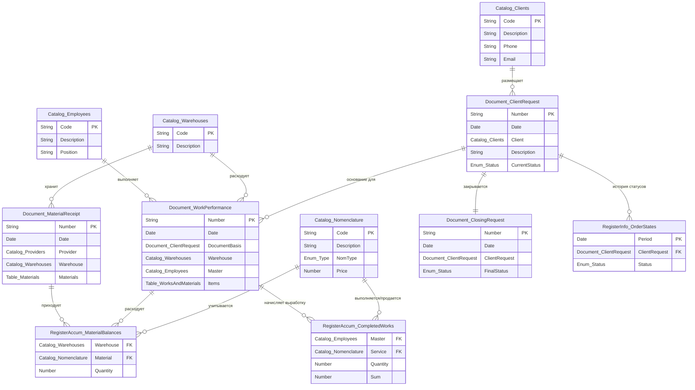
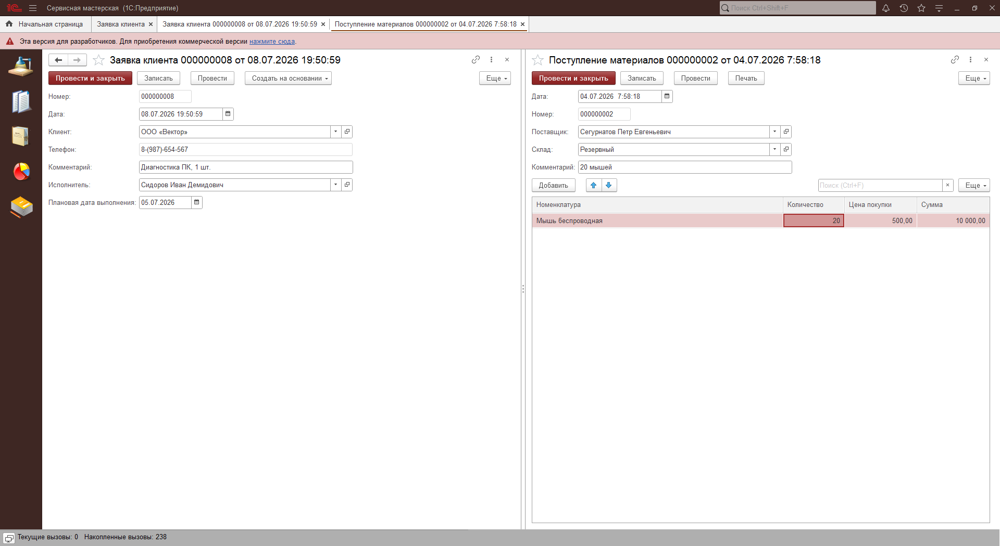
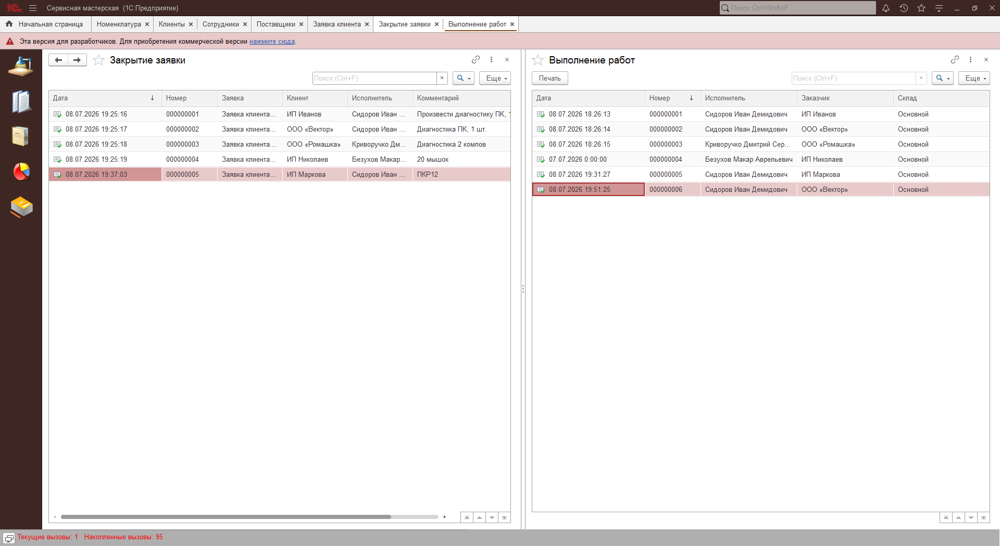
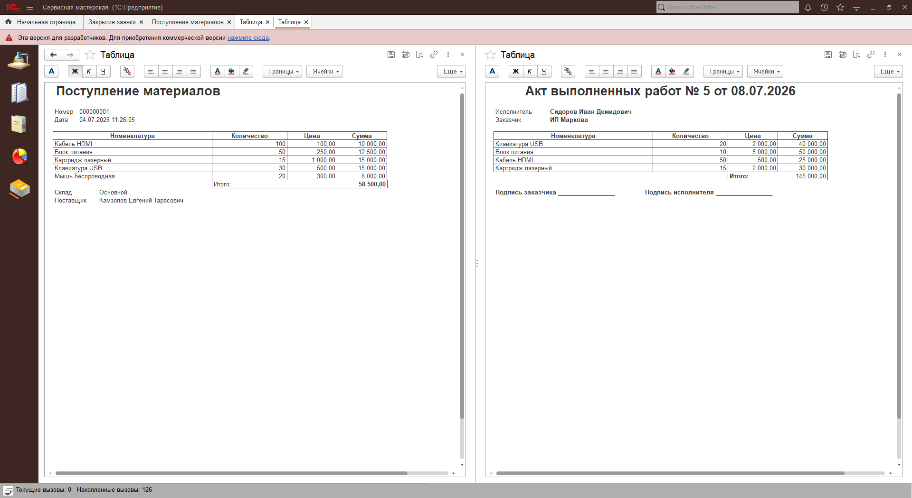
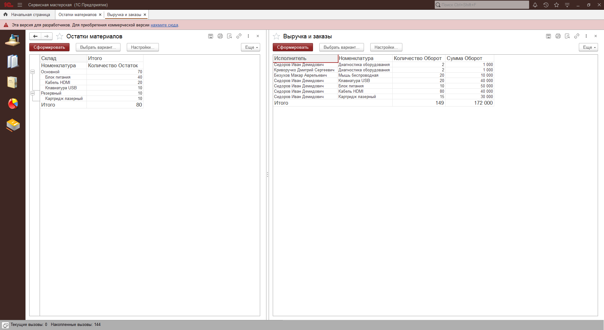
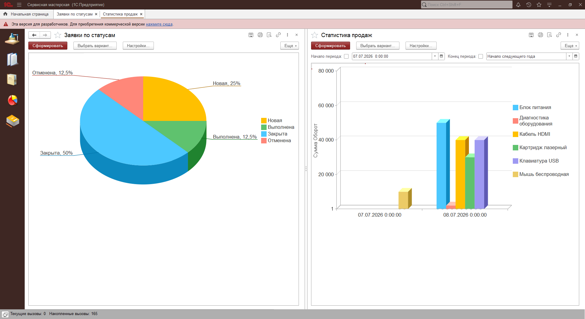
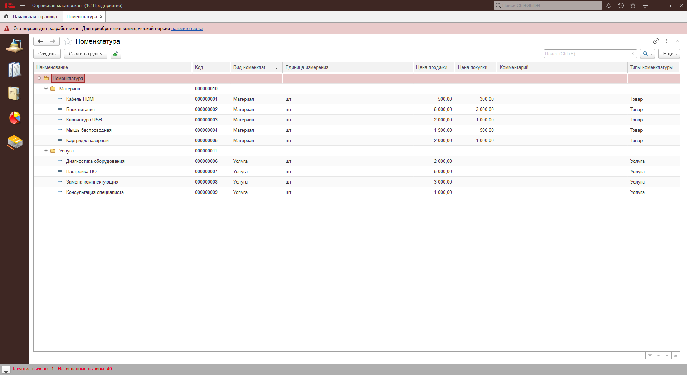

# 🛠️ Master_Service_1C: Автоматизация учета заявок сервисного центра на платформе 1С:Предприятие 8.3

[](https://1c.ru)
[](https://v8.1c.ru/platforma/upravlyaemoe-prilozhenie/)
[](https://v8.1c.ru/platforma/)
[-success?style=for-the-badge)](https://github.com/TheYxel/Master_Service_1C)

## 📋 О проекте

**Master_Service_1C** — специализированное прикладное решение на платформе **1С:Предприятие 8.3 (управляемые формы)**, разработанное для автоматизации бизнес-процессов сервисного центра или ремонтной мастерской. 

В отличие от классических торговых конфигураций, данный проект спроектирован с упором на **сферу услуг и ремонтных работ**. Система обеспечивает сквозной контроль жизненного цикла заявки на ремонт: от первичного обращения клиента и резервирования материалов до списания комплектующих со складов, учета трудозатрат мастеров и анализа финансовой эффективности работы сервиса.

---

## 📊 Архитектурная модель данных (ERD Diagram)

Для демонстрации архитектуры базы данных решения разработана детальная Entity-Relationship-диаграмма (ERD), описывающая связи между справочниками, документами, периодическими регистрами сведений и регистрами накопления:



---

## 🏗️ Архитектура решения и бизнес-логика

Конфигурация разработана по стандартам фирмы «1С» и реализует полноценную сервисную модель учета:

### 1. Объектная модель и разграничение номенклатуры
*   **Справочник `Номенклатура`:** Реализовано строгое разделение на типы «Товар» (материалы/запчасти для ремонта) и «Услуга» (непосредственно ремонтные работы).
*   **Склады и контрагенты:** Учет ведется в разрезе складов хранения материалов, клиентов (заказчиков) и поставщиков комплектующих.

### 2. Жизненный цикл заказа (Конечный автомат статусов)
Бизнес-процесс регламентирован строгой цепочкой документов:
1.  **`ЗаявкаКлиента`** (инициация ремонта, фиксация неисправности).
2.  **`ПоступлениеМатериалов`** (закупка запчастей у поставщиков под ремонт).
3.  **`ВыполнениеРабот`** (фиксация затраченных материалов и услуг мастера). Вводится **строго на основании** `ЗаявкиКлиента`, ручной ввод пустых документов заблокирован на уровне платформы.
4.  **`ЗакрытиеЗаявки`** (финал процесса, перевод заказа в конечный статус и фиксация взаиморасчетов).

### 3. Механизмы контроля и транзакционной безопасности
*   **Отказоустойчивый контроль остатков:** В документе `ВыполнениеРабот` реализован контроль списания материалов со склада. Списание контролируется непосредственно в транзакции проведения с наложением **управляемой блокировки данных** на регистр `ОстаткиМатериалов` (исключительный режим), что исключает коллизии при конкурентной работе пользователей (проблема "Race Condition").
*   **Контроль статусов (State Machine):** Реализован запрет на проведение или редактирование документов цепочки, если связанная `ЗаявкаКлиента` находится в конечных статусах ("Выполнена", "Отменена"). Статус заявки оперативно получается из периодического регистра сведений `СостоянияЗаявок` методом `ПолучитьПоследнее()`.

### 4. Автоматизация интерфейса (UX/UI)
*   **Интерактивный расчет:** На управляемой форме документа `ВыполнениеРабот` реализовано динамическое получение розничной цены номенклатуры из ее карточки при выборе строки, а также мгновенный пересчет сумм на клиенте (`&НаКлиенте`) без лишних серверных вызовов.
*   **Подсистемы и стили:** Интерфейс разделен на логические разделы (Закупки, Оказание услуг, Склад, Отчетность) с использованием корпоративного стиля оформления.

---

## 📈 Аналитический блок и СКД (Reporting)

С помощью встроенной **Системы компоновки данных (СКД)** разработаны интерактивные отчеты для руководства:

*   **Складской баланс:** Таблица текущих остатков расходных материалов и запчастей по складам.
*   **Выработка мастеров:** Отчет по выручке сотрудников-мастеров (на основе оборотного регистра накопления `ВыполненныеРаботы`) с группировкой по исполнителям, исключающей дублирование строк.
*   **Анализ воронки заказов:** Круговая диаграмма долей заявок в разрезе текущих статусов (из регистра `СостоянияЗаявок`).
*   **Динамика продаж:** Информативная гистограмма продаж с накоплением по дням и номенклатурным позициям.

---

## 📂 Структура исходного кода репозитория

Репозиторий содержит чистую выгрузку конфигурации в XML-формате (EDT / Configuration Dump), что свидетельствует о высокой культуре работы с Git:

*   📁 **`Catalogs/`**, **`Documents/`**, **`Enums/`** — исходный код и метаданные справочников, документов и перечислений.
*   📁 **`AccumulationRegisters/`**, **`InformationRegisters/`** — структура и модули проведения регистров.
*   📁 **`CommonModules/`** — общие модули для вынесения переиспользуемой серверной логики.
*   📁 **`Reports/`** — схемы компоновки данных (СКД) встроенных отчетов.
*   📁 **`Styles/`**, **`Subsystems/`**, **`CommonPictures/`** — элементы брендирования и логической структуры интерфейса.
*   📁 **`Img/`** — скриншоты работающей системы для быстрой визуальной оценки ревьюером.

---

## 💻 Пример кода: Безопасный контроль остатков и транзакционная логика

В документе `ВыполнениеРабот` реализован классический паттерн оперативного проведения с контролем отрицательных остатков:

```bsl
// Модуль проведения документа "ВыполнениеРабот"
Процедура ОбработкаПроведения(Отка, РежимПроведения)
	
	// 1. Установка блокировки на регистр остатков материалов
	Блокировка = Новый БлокировкаДанных;
	ЭлементБлокировки = Блокировка.Добавить("РегистрНакопления.ОстаткиМатериалов");
	ЭлементБлокировки.Режим = РежимБлокировкиДанных.Исключительный;
	ЭлементБлокировки.ИсточникДанных = Материалы;
	ЭлементБлокировки.ИспользоватьИзИсточникаДанных("Номенклатура", "Материал");
	Блокировка.Заблокировать();
	
	// 2. Подготовка движений регистра (Расход)
	Движения.ОстаткиМатериалов.Записывать = Истина;
	Движения.ОстаткиМатериалов.Записать(); // Очистка старых движений при перепроведении
	
	Для Каждого СтрокаТЧ Из Материалы Цикл
		Если СтрокаТЧ.Материал.ТипНоменклатуры = ПредопределенноеЗначение("Перечисление.ТипыНоменклатуры.Товар") Тогда
			Движение = Движения.ОстаткиМатериалов.ДобавитьРасход();
			Движение.Период = Дата;
			Движение.Склад = Склад;
			Движение.Номенклатура = СтрокаТЧ.Материал;
			Движение.Количество = СтрокаТЧ.Количество;
		КонецЕсли;
	КонецЦикла;
	
	Движения.ОстаткиМатериалов.Записать(); // Физическая запись новых движений в БД
	
	// 3. Запрос для проверки возникновения отрицательных остатков на Складе
	Запрос = Новый Запрос;
	Запрос.Текст = 
		"ВЫБРАТЬ
		|	ОстаткиМатериаловОстатки.Номенклатура КАК Номенклатура,
		|	ОстаткиМатериаловОстатки.КоличествоОстаток КАК Остаток
		|ИЗ
		|	РегистрНакопления.ОстаткиМатериалов.Остатки(&МоментВремени, Склад = &Склад И Номенклатура В (&СписокМатериалов)) КАК ОстаткиМатериаловОстатки
		|ГДЕ
		|	ОстаткиМатериаловОстатки.КоличествоОстаток < 0";
		
	Запрос.УстановитьПараметр("МоментВремени", Новый Граница(МоментВремени(), ГраницаТипа.Включая));
	Запрос.УстановитьПараметр("Склад", Склад);
	
	// Извлекаем только те материалы из ТЧ, которые относятся к товарам (запчастям)
	СписокМатериалов = Новый Массив;
	Для Каждого СтрокаТЧ Из Материалы Цикл
		Если СтрокаТЧ.Материал.ТипНоменклатуры = ПредопределенноеЗначение("Перечисление.ТипыНоменклатуры.Товар") Тогда
			СписокМатериалов.Добавить(СтрокаТЧ.Material);
		КонецЕсли;
	КонецЦикла;
	Запрос.УстановитьПараметр("СписокМатериалов", СписокМатериалов);
	
	РезультатЗапроса = Запрос.Выполнить();
	Если Не РезультатЗапроса.Пустой() Тогда
		Выборка = РезультатЗапроса.Выбрать();
		Пока Выборка.Следующий() Цикл
			Сообщение = Новый СообщениеПользователю;
			Сообщение.Текст = Шаблон("Недостаточно запчасти '%1' на складе. Дефицит: %2 ед.", 
				Выборка.Номенклатура, -Выборка.Остаток);
			Сообщение.Сообщить();
			Отка = Истина;
		КонецЦикла;
	КонецЕсли;
	
КонецПроцедуры
```

---

## 🖥 Галерея интерфейса (UI Screenshots)

<table align="center">
  <tr>
    <td align="center"><b>Рабочее место мастера (Заявка)</b><br><br><a href="Img/Doc1.png" target="_blank"></a></td>
    <td align="center"><b>Журнал Выполнения работ</b><br><br><a href="Img/Doc2.png" target="_blank"></a></td>
    <td align="center"><b>Печатная форма (Акт работ)</b><br><br><a href="Img/PrintForm.png" target="_blank"></a></td>
  </tr>
  <tr>
    <td align="center"><b>Аналитика заказов по статусам</b><br><br><a href="Img/Report1.png" target="_blank"></a></td>
    <td align="center"><b>Сводный складской баланс</b><br><br><a href="Img/Report2.png" target="_blank"></a></td>
    <td align="center"><b>Номенклатурный классификатор</b><br><br><a href="Img/Items.png" target="_blank"></a></td>
  </tr>
</table>

---

## 🚀 Инструкция по развертыванию решения

1.  **Клонирование репозитория:**
    ```bash
    git clone https://github.com/TheYxel/Master_Service_1C.git
    ```
2.  **Загрузка конфигурации из файлов:**
    *   Создайте пустую информационную базу в режиме Конфигуратора 1С.
    *   В верхнем меню выберите: `Конфигурация` ➡️ `Выгрузить/загрузить конфигурацию` ➡️ `Загрузить конфигурацию из файлов...`.
    *   Укажите корневую папку репозитория, содержащую файл `Configuration.xml`.
3.  **Обновление базы данных:**
    *   Нажмите `F7` (или `Конфигурация` ➡️ `Обновить конфигурацию базы данных`).
4.  **Тестирование:**
    *   Нажмите `F5` для запуска режима «1С:Предприятие». База готова к демонстрации.

---

## 👨‍💻 Об авторе

**Дмитрий Непомнящих**  
Начинающий разработчик на платформе «1С:Предприятие 8.3». Специализируюсь на проектировании систем автоматизации услуг, управлении складскими запасами, разработке бизнес-цепочек ввода на основании, проектировании сложных отчетов СКД и оптимизации транзакционного проведения.

*   📱 **Telegram:** [@N_Dmitry_1C](https://t.me/N_Dmitry_1C)
*   📧 **E-mail:** `n.dmitry-1cdev@mail.ru`

---
*Готов к сотрудничеству, прохождению стажировок и участию в масштабных проектах по внедрению систем на платформе 1С!*
