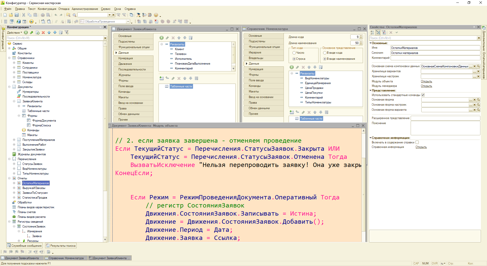
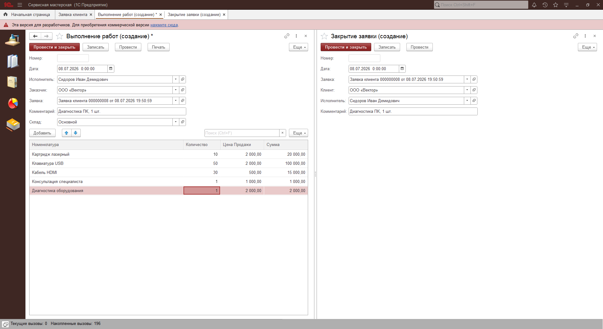

# Учебная конфигурация «Учёт заявок сервисной мастерской»
Разработана на платформе «1С:Предприятие 8.3» (управляемые формы).

## Реализованный функционал:
* **Справочники**: Клиенты, Поставщики, Сотрудники, Номенклатура (с разделением на типы «Товар» и «Услуга»), Склады.
* **Документы и ввод на основании**: 
  - «Заявка клиента» (основной документ цепочки).
  - «Поступление материалов».
  - «Выполнение работ» (вводится строго на основании «Заявки клиента» с запретом ручного создания пустых документов).
  - «Закрытие заявки» (финальный документ цепочки, переводящий заказ в конечный статус).
* **Печатные формы**: Разработаны печатные формы «Акт выполненных работ» (для Выполнения работ) и «Накладная» (для Поступления материалов).
* **Регистры накопления**: 
  - «ОстаткиМатериалов» (количественный учет запасов на складах).
  - «ВыполненныеРаботы» (оборотный регистр для учета выручки в разрезе мастеров).
* **Регистры сведений**: «СостоянияЗаявок» (периодический, для хранения истории статусов заказов).
* **Контроль остатков**: В документе «Выполнение работ» реализована проверка дефицита материалов. Используется оперативное проведение с записью движений и последующим запросом к виртуальной таблице «Остатки» через объект «Граница».
* **Контроль бизнес-логики**: В документе «Заявка клиента» настроен запрет на повторное проведение, если заявка уже закрыта или отменена. Проверка статуса выполняется через метод «ПолучитьПоследнее» регистра сведений.
* **Автоматизация форм**: На форме «Выполнение работ» реализовано автозаполнение цены из карточки номенклатуры при выборе товара, и автоматический пересчет суммы при изменении количества на клиенте.
* **Отчеты (СКД)**:
  - Таблица остатков материалов по складам.
  - Отчет по выручке сотрудников (с группировкой без дублирования строк).
  - Круговая диаграмма долей заявок по статусам.
  - Гистограмма продаж с накоплением по дням и позициям номенклатуры.

## Скриншоты системы:
### Интерфейс Конфигуратора

### Справочник Номенклатура (материал/услуги)

### Документы Заявка Клиента и Поступление Материалов

### Списки документов Закрытие Заявки и Выполнение работ

### Ввод на основании, документы Выполнение Работ и Закрытие Заявки 

### Отчеты Заявки по статусам, Статистика продаж 

### Отчеты Таблица остатков, Выручка и заказы 

### Печатные формы Акт выполненных работ и ПоступлениеМатериалов

