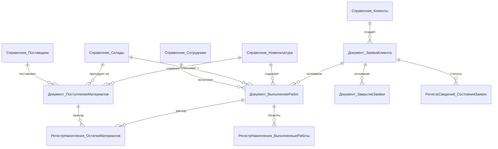
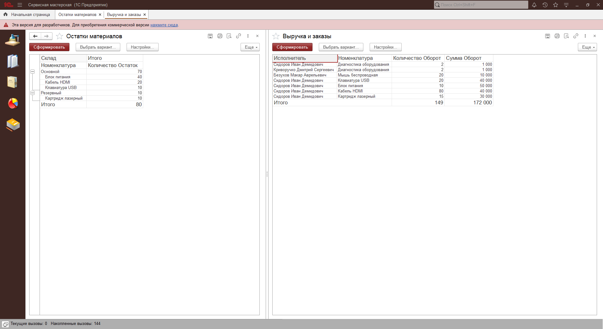
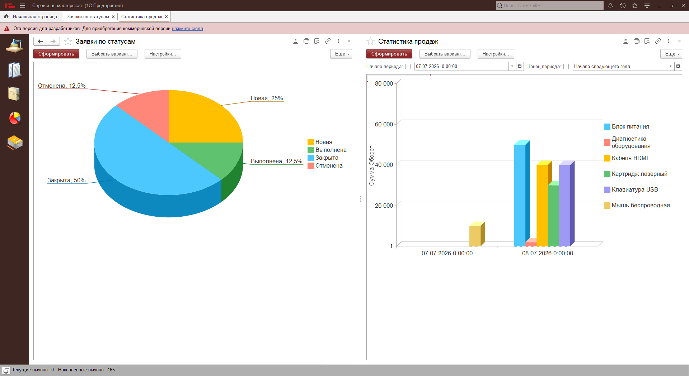
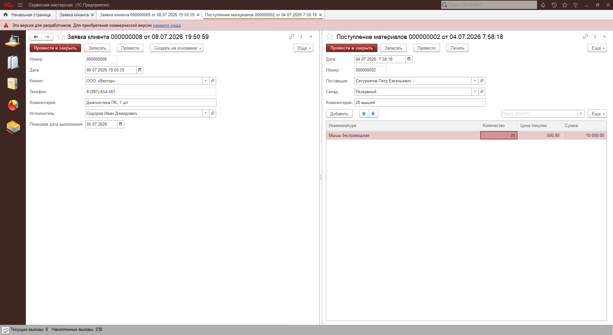
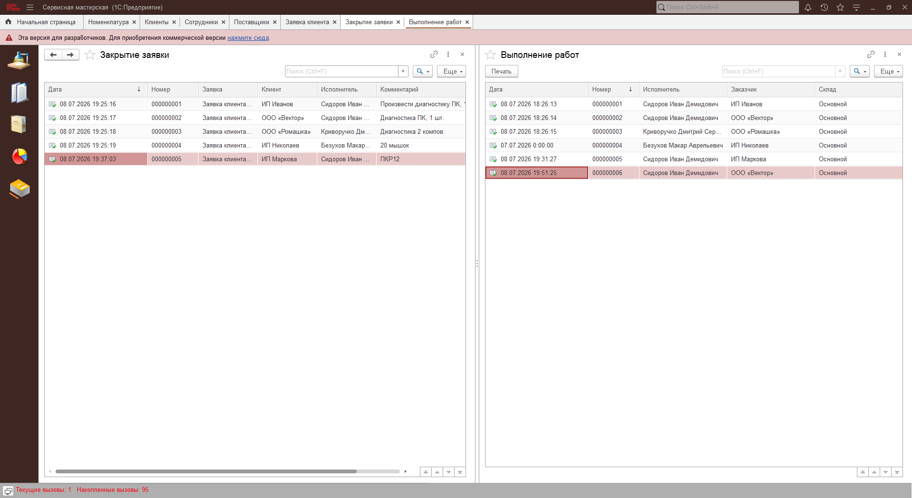
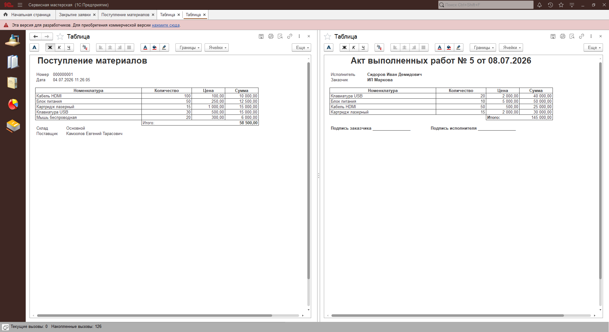
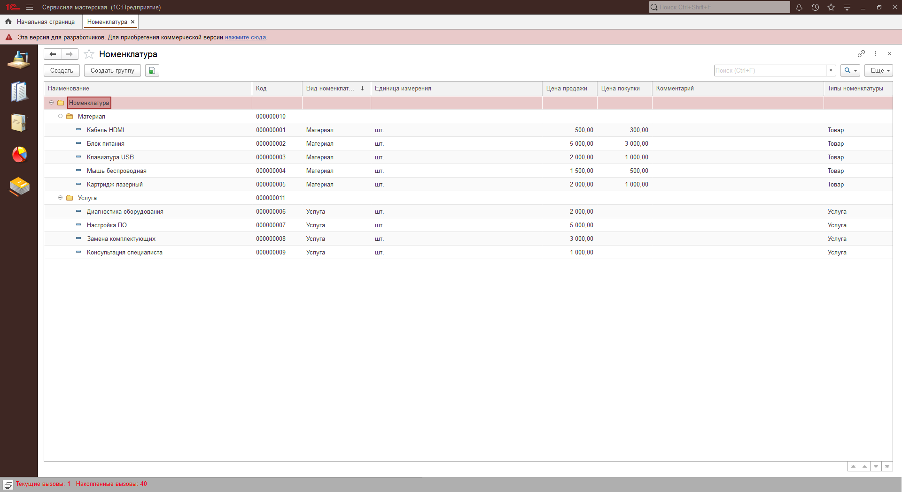

# 🛠️ Master_Service_1C: учёт заявок сервисного центра на 1С:Предприятии 8.3

[](https://1c.ru)
[](https://v8.1c.ru/platforma/upravlyaemoe-prilozhenie/)
[](https://github.com/TheYxel/Master_Service_1C)

## 📋 О проекте

**Master_Service_1C** — учебная конфигурация на платформе **«1С:Предприятие 8.3»** для учёта заявок сервисного центра, материалов и выполненных работ.

Проект разработан в рамках обучения и демонстрирует работу с объектами метаданных, проведением документов, регистрами, запросами, управляемыми формами и **Системой компоновки данных (СКД)**.

---

## 📊 Архитектурная модель данных

Конфигурация включает справочники, документы, регистры накопления и периодический регистр сведений.


```mermaid
erDiagram
    Справочник_Клиенты ||--o{ Документ_ЗаявкаКлиента : "создаёт"
    Справочник_Сотрудники ||--o{ Документ_ВыполнениеРабот : "исполняет"
    Справочник_Поставщики ||--o{ Документ_ПоступлениеМатериалов : "поставляет"
    Справочник_Склады ||--o{ Документ_ПоступлениеМатериалов : "приходует на"
    Справочник_Склады ||--o{ Документ_ВыполнениеРабот : "списывает с"
    Справочник_Номенклатура ||--o{ Документ_ПоступлениеМатериалов : "содержит"
    Справочник_Номенклатура ||--o{ Документ_ВыполнениеРабот : "содержит"

    Документ_ЗаявкаКлиента ||--o{ Документ_ВыполнениеРабот : "основание"
    Документ_ЗаявкаКлиента ||--o{ Документ_ЗакрытиеЗаявки : "основание"
    Документ_ЗаявкаКлиента ||--o{ РегистрСведений_СостоянияЗаявок : "статусы"

    Документ_ПоступлениеМатериалов ||--o{ РегистрНакопления_ОстаткиМатериалов : "приход"
    Документ_ВыполнениеРабот ||--o{ РегистрНакопления_ОстаткиМатериалов : "расход"
    Документ_ВыполнениеРабот ||--o{ РегистрНакопления_ВыполненныеРаботы : "обороты"
```

---

## 🏗️ Объекты конфигурации

### 📚 Справочники

| Объект | Назначение |
|---|---|
| `Клиенты` | Заказчики работ |
| `Сотрудники` | Исполнители работ |
| `Поставщики` | Поставщики материалов |
| `Склады` | Места хранения материалов |
| `Номенклатура` | Товары и услуги, используемые в работах |

### 📄 Документы

| Документ | Назначение |
|---|---|
| `ЗаявкаКлиента` | Регистрация обращения клиента и исходных данных по заявке |
| `ПоступлениеМатериалов` | Приход материалов на склад |
| `ВыполнениеРабот` | Списание материалов и регистрация выполненных работ |
| `ЗакрытиеЗаявки` | Закрытие заявки после регистрации выполненных работ |

### 🗂️ Регистры

| Регистр | Вид | Назначение |
|---|---|---|
| `ОстаткиМатериалов` | Регистр накопления, остатки | Учёт количества материалов по складам и номенклатуре |
| `ВыполненныеРаботы` | Регистр накопления, обороты | Учёт работ, исполнителей, клиентов, номенклатуры и суммы |
| `СостоянияЗаявок` | Периодический регистр сведений | Хранение истории статусов заявки |

### 🔐 Роли конфигурации

| Роль | Назначение |
|---|---|
| `Администратор` | Полный доступ ко всем объектам конфигурации |
| `Менеджер` | Доступ к оперативной работе с документами, справочниками и отчётами |

---

## ⚙️ Бизнес-логика

### 1. Последовательность документов

1. Создаётся и проводится **`ЗаявкаКлиента`** — ей присваивается статус **«Новая»**.
2. Материалы приходуются документом **`ПоступлениеМатериалов`**.
3. На основании заявки создаётся **`ВыполнениеРабот`**. При проведении:
   - товары списываются с выбранного склада;
   - в регистр `ВыполненныеРаботы` записываются количество и сумма по строкам документа;
   - в историю статусов заявки записывается статус **«Выполнена»**.
4. На основании заявки создаётся **`ЗакрытиеЗаявки`**. Перед записью проверяется наличие проведённого документа выполнения работ; при проведении заявке присваивается статус **«Закрыта»**.

### 2. Контроль остатков

При **оперативном проведении** документа `ВыполнениеРабот` формируются расходные движения по регистру накопления `ОстаткиМатериалов`. Затем выполняется запрос к виртуальной таблице `Остатки()` по выбранному складу.

Если после проведения обнаружен отрицательный остаток, проведение отменяется, а пользователю выводится сообщение с наименованием товара и величиной дефицита.

### 3. Контроль статусов

Актуальный статус заявки получается из периодического регистра сведений `СостоянияЗаявок` методом `ПолучитьПоследнее()`.

Для заявок в статусах **«Закрыта»** и **«Отменена»** запрещено перепроведение документа заявки.

### 4. Управляемые формы

В форме документа `ВыполнениеРабот` реализованы:

- получение розничной цены номенклатуры при выборе строки;
- пересчёт суммы строк табличной части на клиенте;
- разделение интерфейса по подсистемам: закупки, оказание услуг, склад и отчётность.

---

## 📈 Отчёты на СКД

В конфигурации реализованы четыре отчёта:

- **Остатки материалов** — текущие остатки номенклатуры по складам;
- **Выручка и заказы** — данные о выполненных работах и суммах;
- **Заявки по статусам** — распределение заявок по актуальным статусам;
- **Статистика продаж** — динамика продаж по дням и номенклатуре.

<table align="center">
  <tr>
    <td align="center"><b>Заявки по статусам</b><br><br><a href="Img/Report1.png"></a></td>
    <td align="center"><b>Остатки материалов</b><br><br><a href="Img/Report2.png"></a></td>
  </tr>
</table>

---

## 🖥️ Галерея интерфейса

<table align="center">
  <tr>
    <td align="center"><b>Рабочее место: заявка</b><br><br><a href="Img/Doc1.png"></a></td>
    <td align="center"><b>Журнал выполнения работ</b><br><br><a href="Img/Doc2.png"></a></td>
    <td align="center"><b>Печатная форма</b><br><br><a href="Img/PrintForm.png"></a></td>
  </tr>
  <tr>
    <td align="center" colspan="3"><b>Справочник номенклатуры</b><br><br><a href="Img/Items.png"></a></td>
  </tr>
</table>

---

## 📂 Структура репозитория

```text
Catalogs/                Справочники и их формы
Documents/               Документы, формы и модули объектов
AccumulationRegisters/   Регистры накопления
InformationRegisters/    Регистр сведений статусов заявок
Reports/                 Отчёты и схемы компоновки данных
Subsystems/              Подсистемы конфигурации
Img/                     Скриншоты интерфейса и отчётов
Configuration.xml        Описание конфигурации для загрузки из файлов
DemoBase.dt              Демонстрационная информационная база
```

Конфигурация выгружена в XML-файлы из Конфигуратора и размещена в Git.

---

## 🚀 Запуск проекта

### Загрузка конфигурации из файлов

1. Клонируйте репозиторий:

   ```bash
   git clone https://github.com/TheYxel/Master_Service_1C.git
   ```

2. Создайте пустую информационную базу в Конфигураторе «1С:Предприятие 8.3».
3. Выберите **Конфигурация → Загрузить конфигурацию из файлов**.
4. Укажите корневую папку репозитория, содержащую `Configuration.xml`.
5. Выполните **Конфигурация → Обновить конфигурацию базы данных** (`F7`).
6. Запустите базу в режиме «1С:Предприятие» (`F5`).

### Демо-база

Файл `DemoBase.dt` содержит демонстрационную информационную базу. Его можно загрузить в новую базу средствами Конфигуратора, чтобы посмотреть интерфейс и демонстрационные данные.

---

## ✅ Сценарии ручной проверки

1. Создать склад и номенклатуру типа «Товар».
2. Оформить и провести `ПоступлениеМатериалов` с положительным количеством.
3. Создать и провести `ЗаявкаКлиента`.
4. На основании заявки создать и провести `ВыполнениеРабот` с количеством, не превышающим остаток.
5. Проверить движения документа и отчёт «Остатки материалов».
6. Повторить проведение с количеством больше доступного остатка: проведение должно быть отменено с сообщением о дефиците.
7. Создать на основании заявки `ЗакрытиеЗаявки`: без проведённого документа выполнения работ запись должна быть запрещена.

---

## 🔄 История изменений и доработок

- **Добавлены роли и права доступа:** созданы базовые профили `Администратор` и `Менеджер` для разграничения прав пользователей.
- **Улучшена безопасность проведения (`ВыполнениеРабот`):** внедрены явные управляемые блокировки (`БлокировкаДанных`) для защиты от конкурентного списания материалов (гонки транзакций / Race Condition).
- **Оптимизирован код проведения документов:** устранены потенциальные ошибки выполнения при получении статусов заявок через запросы вместо небезопасных срезов.
- **Обновлены интерфейсы и формы:** добавлены дополнительные колонки и связи в формы списков документов и справочников.

---

## ⚠️ Ограничения учебного проекта

Проект не является готовым промышленным решением. В текущей версии не реализованы:

- интеграции с внешними системами;
- автоматизированные тесты.

---

## 👨‍💻 Об авторе

**Дмитрий Непомнящих** — начинающий 1С-разработчик.

- 📱 **Telegram:** [@N_Dmitry_1C](https://t.me/N_Dmitry_1C)
- 📧 **E-mail:** [n.dmitry-1cdev@mail.ru](mailto:n.dmitry-1cdev@mail.ru)

---

*Проект создан для развития практических навыков разработки на платформе «1С:Предприятие 8.3».*
